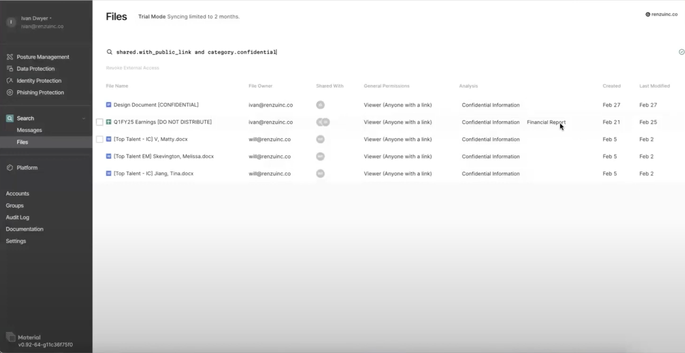

# Finding Sensitive Information in Google Drive

## Introduction
Material Security's data protection for Google Drive helps organizations identify and protect sensitive information stored in their Google Drive environment. This documentation provides guidance on how to use the file search interface to discover and remediate sensitive content.

## File Search Interface
The file search interface in Material Security provides a comprehensive set of filters and selectors to help you quickly find and analyze sensitive files in your Google Drive. Some key features of the interface include:

1. ### Content Classifications
The search interface allows you to filter files by various content classifications, such as personal, financial, health, or confidential information. Material Security's machine learning engine has been trained to detect these types of sensitive data in file contents.

2. ### File Metadata
You can search based on file metadata, including file type, ownership, location (personal vs. shared drives), and last modified date.

3. ### Sharing Permissions
A powerful feature of the search interface is the ability to filter files based on their sharing permissions. You can identify files that are shared externally, shared with specific email addresses or domains, or shared publicly via a link.

4. ### Search and Remediation
Once you've identified sensitive files, you can take action to remediate the risks. The interface allows you to select one or more files and revoke external access or restrict sharing permissions as needed.

## Step-by-Step Guide
Here's how you can use the file search interface to find and protect sensitive information in Google Drive:

1. **Access the File Search Interface**: Log in to the Material Security dashboard and navigate to the "Data Protection" section. Here you will find the file search interface.

2. **Define Your Search Criteria**: Use the various filters and selectors to build your search query. For example, you could start by looking for files classified as "Confidential" that are shared externally.

3. **Review Search Results**: The search results will display detailed information about each file, including the file name, owner, and sharing permissions. Carefully review the results to identify any potentially sensitive content.

4. **Remediate Risks**: For files that contain sensitive information and have overly permissive sharing settings, you can take action to restrict access. Select the file(s) and use the "Revoke External Access" or "Restrict Sharing" options to limit who can view or edit the content.

5. **Automate Monitoring and Remediation**: In the near future, Material Security will provide the ability to set up webhooks and automated policies to proactively monitor for and remediate sensitive content sharing. This will help you stay on top of data protection without manual intervention.
