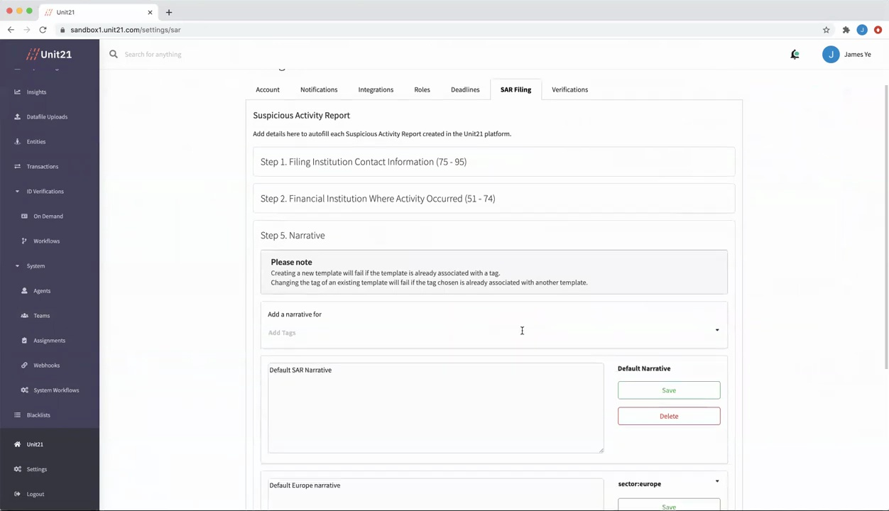

# Customizing SAR Narratives

## Introduction

The Suspicious Activity Report (SARS) filing process is a crucial component of anti-money laundering (AML) and counter-terrorist financing (CTF) efforts. Within the Unit 21 dashboard, you have the ability to customize the SARS narratives to ensure they are accurate, relevant, and tailored to your specific needs.

## Accessing the SARS Filing Section

To access the SARS filing section in the Unit 21 dashboard, follow these steps:

1. Log in to the Unit 21 dashboard.
2. Locate the "Settings" tab on the left-hand side of the dashboard.
3. Click on the "SARS Filing" tab within the Settings section.

The SARS filing section provides you with various options to configure the pre-populated information that will be included in your SARS reports.

## Configuring SARS Narrative Settings

Within the SARS filing section, you can customize the default SARS narrative and create additional custom narratives that can be associated with specific tags or case types.

1. **Set the Default SARS Narrative**: In the "Narrative" section, you can edit the default SARS narrative that will be used if no other custom narratives are applicable.
2. **Create Custom Narratives**: To create a custom narrative, click on the "Add New" button in the "Narrative" section. You can then assign this narrative to specific tags or case types.
3. **Assign Custom Narratives**: In the "Narrative" section, you can select the appropriate tag or case type from the dropdown menu and associate it with the custom narrative you created.

The order of precedence for selecting the appropriate narrative is as follows:
1. Custom narratives associated with specific tags or case types
2. Default SARS narrative

## Generating SARS Reports

When creating a SARS report from a case in the Unit 21 dashboard, the pre-populated narrative information will be populated based on the selected tags or the default settings you have configured in the SARS filing section.

## Editing SARS Narratives

You can edit the default SARS narrative or any custom narratives you have created in the "Narrative" section of the SARS filing settings. It is important to maintain accurate and relevant narratives to ensure the effectiveness of your SARS filing process.

## Best Practices

- Regularly review and update your SARS narratives to reflect any changes in your business operations or regulatory requirements.
- Collaborate with your compliance team to ensure the narratives are clear, concise, and provide the necessary information for SARS filing.
- Implement a review process to ensure the narratives are accurate and consistent across all cases.
- Train your team on the importance of accurate SARS narratives and the process for customizing them in the Unit 21 dashboard.
