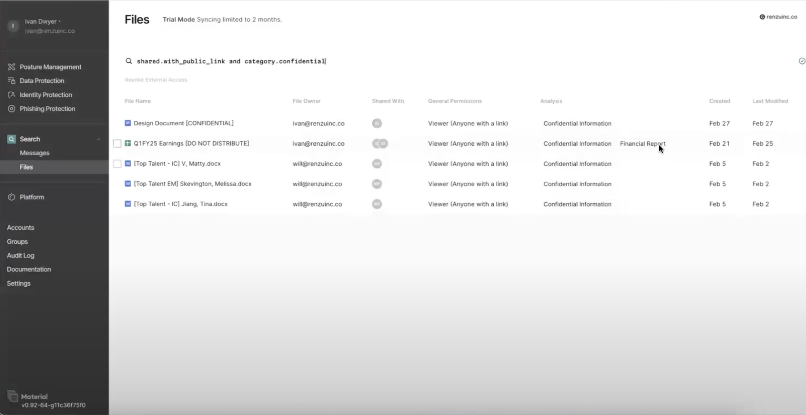
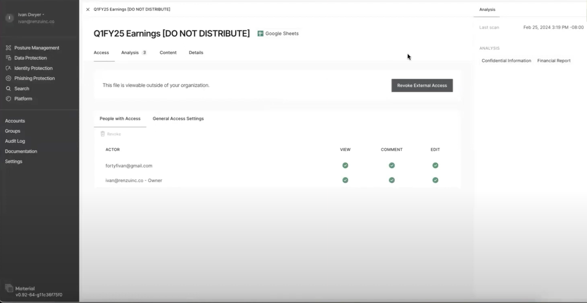
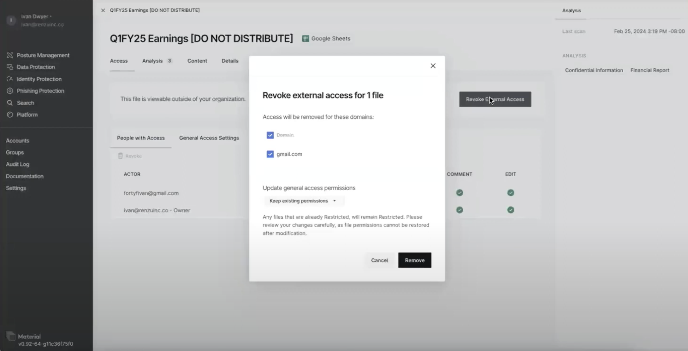

# Revoking external access to sensitive files

## Overview

Material Security's data protection for Google Drive allows you to identify and revoke external access to sensitive files stored in your organization's Google Drive. This feature provides the following capabilities:

1. **Automated Content Classification**: Material Security's machine learning engine scans the content of your Google Drive files and automatically classifies them based on the presence of sensitive information like personally identifiable information (PII), financial data, and confidential content.

2. **Visibility into Sharing Permissions**: The file search interface allows you to quickly identify files that are shared externally, either through public links or with specific email addresses and domains.

3. **One-click Revocation of External Access**: For files that are classified as sensitive and shared externally, you can easily revoke access with a single click, removing public links and external email permissions.

4. **Customizable Policy Enforcement**: In the future, Material Security will allow you to define policies that automatically notify file owners or revoke external access when sensitive files are shared outside your organization, providing a more proactive approach to data protection.

## Getting Started

To start using the data protection for Google Drive feature, follow these steps:

1. **Connect your Google Workspace Account**: In the Material Security dashboard, navigate to the "Integrations" section and connect your Google Workspace account. This will allow Material Security to access and scan your organization's Google Drive files.

2. **Select the Drives to Protect**: Choose which of your organization's Google Drives you want Material Security to monitor and protect. This can include both individual user drives and shared drives.

3. **Configure Content Classifications**: Review the pre-defined content classifications that Material Security uses to identify sensitive information, such as PII, financial data, and confidential content. You can customize these classifications to match your organization's specific needs.

## Using the File Search Interface

1. **Access the File Search**: In the Material Security dashboard, click the "File Search".

2. **Perform Sensitive File Searches**: Use the advanced search capabilities to quickly identify files that meet specific criteria, such as:
   - Files containing sensitive content (e.g., PII, financial data)
   - Files shared externally, either through public links or with specific email addresses/domains
   - Files owned by specific users or stored in particular locations (e.g., shared drives)

3. **Review File Details**: When you select a file from the search results, you can view detailed information about the file, including the content analysis, sharing permissions, and ownership.

4. **Revoke External Access**: For files that are classified as sensitive and shared externally, you can revoke access by removing public links and external email permissions. Material Security will immediately update the file's sharing settings to restrict access to only authorized users within your organization.

